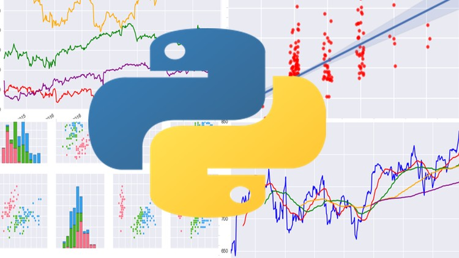

# Codecademy: Analize Data with Python

Analyze Data with Python

Projects completed on the Skill Path focused on 
- Statistics
- Data visualization
- Data manipulation
- Analysis techniques

## Modules:
1. Data Analysis
2. Python
3. NumPy: A Python Library for Statistics
4. Data Manipulation with Pandas
5. Data Visualization with Matplotlib
6. Statistics for Data Analysis
7. Hypothesis Testing with SciPy
8. Final Projects